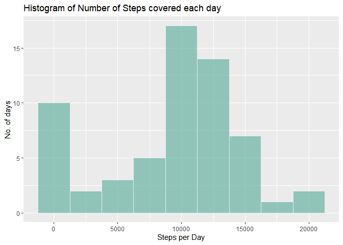
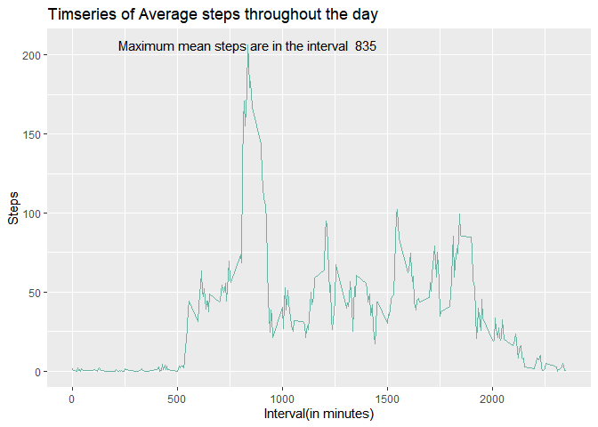
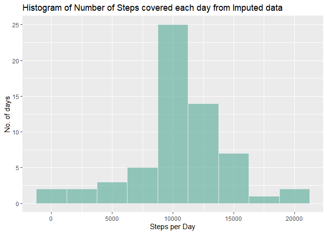
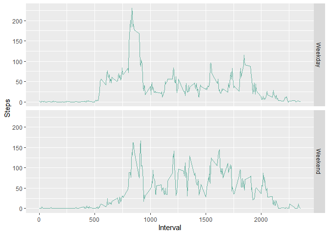

## Loading and preprocessing the data 
I first load the data and preprocess it to make the dates of the 'date' datatype


```r
unzip("activity.zip")
data<-read.csv("activity.csv",stringsAsFactors = F)
data$date<-as.Date(strptime(data$date,"%F"))
```

## What is mean total number of steps taken per day? 
For the total number of steps taken per day, we have the following code and hisogram. It roughly follows the bell curve. The spike in '0' step days is probably due to the missing values that were removed(hence treated as 0).


```r
spd<-tapply(data$steps,data$date,sum,na.rm=T,simplify=TRUE)
meanspd<-mean(spd)
medianspd<-median(spd)
spd=as.data.frame(spd)
ggplot(spd,aes(x=spd))+
    geom_histogram(binwidth=2500,fill="#69b3a2", color="#e9ecef", alpha=0.7)+
    xlab("Steps per Day")+
    ylab("No. of days")+
    ggtitle("Histogram of Number of Steps covered each day")
```

<!-- -->

The individual covers a mean of 9354.23 steps and a median of 10395 steps per day. 

## What is the average daily activity pattern? 

Below is the Timeseries of the average daily activity pattern


```r
ts<-tapply(data$steps,data$interval,mean,na.rm=T)
ts=data.frame(as.numeric(names(ts)),ts)
names(ts)<-c("Interval","Steps")

max<-which.max(ts$Steps)
max<-ts[max,]

ggplot(ts,aes(x=Interval,y=Steps))+
    geom_line(color="#69b3a2")+
    ggtitle("Timseries of Average steps throughout the day")+
    xlab("Interval(in minutes)")+
    annotate(geom="text", x=max$Interval, y=max$Steps,
             label=paste("Maximum mean steps are in the interval ",max$Interval))
```

<!-- -->


The interval 835 has the maximum average of 206.17 steps 

## Imputing missing values 

We notice that missing values are exclusively in the 'steps' column and not in the 'date' or 'interval' column


```r
nas<-sum(is.na(data$steps))
impdata<-data
indNA<-which(is.na(impdata$steps))

#The below code immputes na values by the average steps per interval as already calulated in ts 
impdata$steps[indNA]<-sapply(impdata$interval[indNA],function(x){ts[which(ts$Interval==x),2]})

spd2<-tapply(impdata$steps,impdata$date,sum,simplify = TRUE)
meanspd2<-mean(spd2)
medianspd2<-median(spd2)
spd2=as.data.frame(spd2)
ggplot(spd2,aes(x=spd2))+
    geom_histogram(binwidth=2500,fill="#69b3a2", color="#e9ecef", alpha=0.7)+
    xlab("Steps per Day")+
    ylab("No. of days")+
    ggtitle("Histogram of Number of Steps covered each day from Imputed data")
```

<!-- -->

Total missing values in the dataset is 2304. The individual covers a mean of 10766.19 steps and a median of 10766.19 steps per day in the imputed data. Both the median and mean have increased. Further, the height of histogram at '0' has drastically decreased and other values have seen an increase. This happened because previously missing values were treated as 0 but now that we've imputed, they are taking different values as well.

## Are there differences in activity patterns between weekdays and weekends? 

Below is the R code for studying the comparison


```r
#To add a column for indicating weekend or weekday
impdata$Daytype<-weekdays(impdata$date,abbreviate = T)
impdata$Daytype<-sapply(impdata$Daytype,function(x)
                                        {
                                            if(x=="Sat" | x=="Sun")
                                                "Weekend"
                                            else
                                                "Weekday"
                                        })
#Code for creating the data frame for the time series, separated by weekdays or weekends
ts2<-split(impdata$steps,interaction(impdata$Daytype,impdata$interval))
ts2<-sapply(ts2,mean)
ts2<-as.data.frame(ts2)
columns<-do.call(rbind, strsplit(row.names(ts2),".",fixed=T))
row.names(ts2)<- 1:nrow(ts2)
ts2<-cbind(ts2,columns,stringsAsFactors=F)
names(ts2)<-c("Steps","DayType","Interval")

ts2<-transform(ts2,DayType=as.factor(DayType),Interval=as.numeric(Interval))


ggplot(ts2,aes(x=Interval,y=Steps))+
    geom_line(color="#69b3a2")+
    facet_grid(DayType~.)
```

<!-- -->


As we can see, in the weekends there's a drop in the peak activity(around interval 750-1000) but an increase in medium activity(1000 to 2000)


